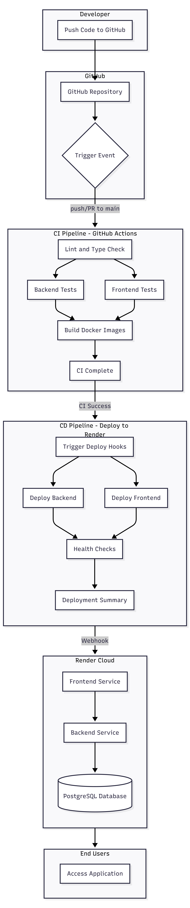

# CI/CD Pipeline Flow

This diagram illustrates the complete CI/CD pipeline for the Task Management Application. When a developer pushes code to the main branch, GitHub Actions triggers the CI pipeline which runs linting, type checks, tests, and builds Docker images. Upon successful CI completion, the CD pipeline automatically deploys the frontend and backend services to Render Cloud, where they connect to the PostgreSQL database and become accessible to end users.

## Keep-Alive Workflow

The `keep-alive.yml` workflow prevents Render free tier services from spinning down due to inactivity:

- **Schedule**: Runs every 14 minutes (under Render's 15-minute spin-down threshold)
- **Frontend ping**: Directly pings `https://taskmanager-frontend-vdo4.onrender.com/`
- **Backend ping**: Pings `$RENDER_BACKEND_URL/api/health` using repository secret
- **Manual trigger**: Can be triggered manually via `workflow_dispatch`

### GitHub Actions Minutes Usage
- **Public repos**: Unlimited free minutes
- **Private repos**: ~510 min/month (~25% of 2000 free minutes)
